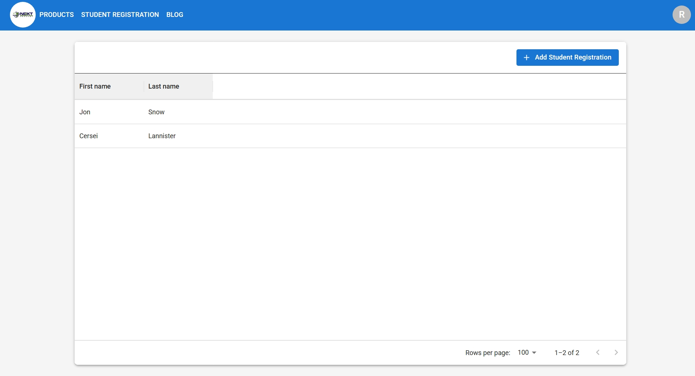

# Lavaloone - Student Registration Portal

## Project Overview
Lavaloone is a student registration portal designed for educational institutions to manage student enrollments efficiently.

## Live Website
The application is currently hosted at:  
[https://academy.psc-s.com/registration/student-registration](https://academy.psc-s.com/registration/student-registration)

## Screenshot

## Features
- Student registration form
- Data validation
- Responsive design
- Secure submission process

## Installation
(Add installation instructions if applicable)

## Usage
(Add usage instructions if applicable)

## Contributing
(Add contribution guidelines if applicable)

## License
(Add license information if applicable)

---

Note: I've created a more structured README.md file based on the information you provided. You may want to:
1. Add more details about the project's features and functionality
2. Include installation/usage instructions if this is a project others might install
3. Add contribution guidelines if it's open source
4. Specify license information

The image reference assumes sc1.jpeg is in the same directory as the README.md file. If it's in a different location, adjust the path accordingly.